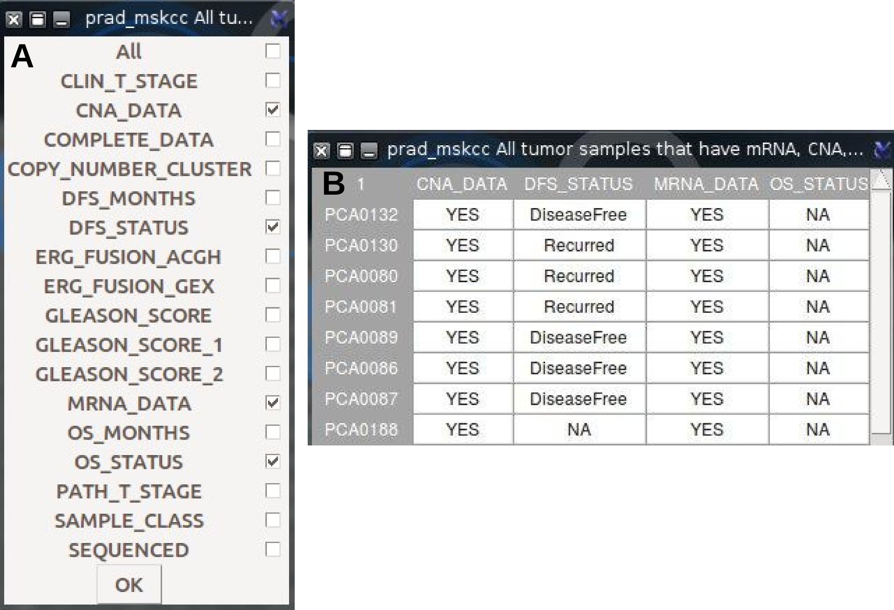

<!--
Specify the vignette engine in the .Rmd files (inside HTML comments)
-->

<!--
%% \VignetteEngine{knitr::knitr}
-->

```{r style, echo = FALSE, results = 'asis'}
BiocStyle::markdown()
```

```{r setup, include=FALSE}
knitr::opts_chunk$set(echo = TRUE)
BiocStyle::markdown()
```


# Introduction

`canceR` is  a graphical user friendly interface to explore, compare, and analyse all available Cancer Data (Clinical data, Gene Mutation, Gene Methylation, Gene Expression, Protein Phosphorylation, Copy Number Alteration) hosted by the Computational Biology Center (cBio) at Memorial-Sloan-Kettering Cancer Center (MSKCC). `canceR` implements functions from various packages:
1. to acces, explore and extract Genomics Cancers Data Base of MSKCC (`cgdsr`,[@Cerami2012,@Gao2013]),

2. to associate phenotypes with gene expression (`phenoTest`, [@Planet2013]),

3. to predict which biological process or pathway or immune system are significantly different under the phenotypes and which genes are associated (`GSEA-R`~[Subramanian2005,Subramanian2007]),

4. to predict the most up/down regulated gene sets belonging to one of MSigDB collections~[Subramanian2005] (`GSEAlm`,[@Oron2008]),

5. to classify genes by diseases (`geNetClassifier`,[@Aibar2013]), or

6. to classify genes by variable or phenotype (`rpart`, [@Therneau2014]),

7. to plot genes correlations.

8. to plot survival curves

9. to plot muti-omics data using Circos style (`circlize`, [@Gu2014])


# Installation


## Suplementary librairies (Not R packages)

* ktable http://tktable.sourceforge.net/

* Widget http://sourceforge.net/projects/tcllib/files/BWidget/

* nuWin32 (for Windows) http://sourceforge.net/projects/getgnuwin32/?source=typ_redirect

For Debian distribution (GNU/Linux)
```{setup, include=FALSE}
sudo apt-get insall ("r-cran-tcltk2","r-cran-tkrplot")
sudo apt-get install(✬Tk-table✬, ✬BWidget✬)
sudo apt-get install libcurl4-openssl-dev
sudo apt-get install r-cran-xml
```

For Windows distribution

[LibXml2](http://sourceforge.net/projects/gnuwin32/files/): parser for XML 

For OS X distribution X11: graphics device
run R and write theses lines in console to install dependancies.

```{r eval=FALSE}
install.packages("RCurl", "XML")
install.packages(c("cgdsr","tkrplot","Formula", "RSvgDevice","RCurl" ))
```

##  dependencies from Bioconductor

```{r eval=FALSE}
library(biocManager)
biocManegr::install("GSEABase", "GSEAlm","geNetClassifier","Biobase", "phenoTest")
BiocManager::install("canceR")
```

Get the development version from github
```{r eval=FALSE}
library(devtools)
devtools::install_git("kmezhoud/canceR")
```

# Starting Window
run R and write theses lines in console to run canceR package.

```{r eval=FALSE}
library(canceR)
canceR()
```

The starting window (Figure 1) loads all available Cancer Studies (Figure 1 3) or search some ones by keyword (Figure 1 4). Before to get Cancers Data (Figure 1 7), it is important to set workspace for output files (Figure 1 1). The starting window displays Help menu where user can get this vignette (Figure 1 2).


Figure 1: Starting Windows. 1, File Menu; 2, Help Menu; 3, Button to get all available studies; 4, Button to get only matched studies using key words; 5, list box that displays the number of studies listed in 6; 6, list box that displays the result of quering the Cancer Genomics Data Server. User can select one or multiple Studies; 7, Button to get Genetic Profiles and Clinical data for selected Studies.

## Setting Workspace

canceR package uses input files to compute models and generates output files for biological knowledges. It is important to set workspace and know the location of used files and results. The Button `Set Workspace` allows user to set easily workspace (Figure 2). User needs just to browse workspace folder or creates a new one. The others necessary folders would be created by simple pressing `Set` buttons.


Figure 2: Setting Workspace

# Main Window

After selecting studies and pressing on `Get Cases and Genetic Profiles` Button, the main window appears (Figure 3) and displays the progress of loading data of selected studies. The Main Window has a Toolbar with Menus (see following paragraphs). It is subdivised in two columns. The first column lists Cases for all selected studies. The first line of every study indicates its Index and its short description. The remain lines enumerate Cases with short description of data type and the number of samples. The second list box shows selected Cases. Similarly, the second column displays informations of Genetic Profiles.
User can select a single or multiple lines with attention to correspond the Case with appropriate Genetic Profile.


Figure 3: Main Window of canceR package. 1, Toolbar, 2, list box of loaded Cases; 3, list box of selected Cases; 4, list box of loaded Genetic Profiles; 5, list box of selected Genetic Profiles

## Gene List

The first step to get genomics data is to specify what are interesting genes for user. The Gene List button browses folders to load Gene list file or displays examples of genes list. The genes could be in text file (.txt) with one gene by line using HUGO gene Symbol. The function removes automatically duplicate genes.

## Clinical Data

The Multiple Cases button displays successively selected Cases. Results are returned in a table with row for each case and a column for each clinical attribute (Figure 4B). User could select all or some clinical data by checking dialog box (Figure 4A). For example, we select clinical attributes:

* Overall Survival months: Overall survival, in months.

* Overall Survival Status: Overall survival status, usually indicated as `LIVING` or `DECEASED`.

* Disease Free Survival months: Disease free survival, in months.

* Disease Free Survival status: Disease free survival status, usually indicated as `DiseaseFree` or `Recurred/Progressed`.

* Age at diagnosis: Age at diagnosis.



Figure 4: Getting clinical data for Breast Invasive Carcinoma. A, Dialog Check Box to select clinical data; B, Results of quering clinical data of Breast Invasive Carcinoma (TCGA, Nature 2012).


## Mutation

User can search all mutation in gene list of all selected studies. He needs to select All tumors samples in Cases and Mutations in gentics profiles to get mutations (Figure 5).


Mutation function allows user to select about 15 informations corresponding to mutations (Fig-
ure 6A). The results is a table with rows for each sample/case, and columns corresponding to the
informations cheched in dialog mutation check box (Figure 6B).


User can filter mutation result only for specific amino acid change (Figure 7).


## Methylation
User can search gene methylation and its correlation with mRNA expression. User needs to select Cases and Genetic Profiles with same methylation assay (HM450 or HM27) for the same study. Multiple Cases selection is allowed for one gene list (Figure 8).


The dialog box of `methylation` function allows user to specify the threshold of the correlation rate (Figure~\ref{Met_rate}A). cBioportal~[@Cerami2012,@Gao2013] includes only methylation data from the probe with the strongest negative correlation between the methylation signal and the gene's expression. The result table (Figure~Figure 9B) lists genes with median of rate upper than 0.8.


## Profiles

The function get Profile Data depends on gene list, cases, and genetic profiles. If a `Single gene` option is done, dialog box appears to specify gene symbol (Figure~Figure 10A). The returned dialog check box allows user to choose some/all profiles data (Figure~Figure 10B). The result (table) lists some/all genetic profiles data in columns (CNA, Met, Mut, mRNA,RPPA) and all available samples in rows (Figure~Figure 10C). Oppositely, if `Multiple genes` option is done, the returned table displays genes expression for gene list (column) for all samples (rows). In the case of multiple genes, the tables are saved in `Results/ProfilesData` folder.


## PhenoTest

The function was implemented from package `PhenoTest`~[@Planet2013]. The object of this function is to predict the association between a list of phenotype variables (Survival, DFS~Status, OS~Status) and the gene expression. There are two possible formula to get associations:

1. Three variables: `Survival` status (event/time as Dead-Living / 30 Months), `Categorical` or `ordinal` description (DSF~STATUS or Tumor stage), and `Continuous` value (DFS~MONTHS, Tumor size).
2. Two variables:  `Categorical` or `ordinal` description (DSF~STATUS or Tumor stage), and `Continuous` value (DFS~MONTHS, Tumor size). In this case user does not need to select any variables for survival variable in the phenoTest dialog box (Figure~11A).


The output of this function does not expect to give  systematically  a relevant association between all formula of the chosen variables, although in some cases it  is possible to cluster a list of  genes significantly regulated (gene expression) at a range of tumor size (continuous)  or tumoral stage (ordinal) for recurred or DiseaseFree cases (survival and categorical). 
The type of variables could be explored with Clinical Data tables and selected in the phenoTest dialog box (Figure~\ref{PhenoTest; A, Dialog Boxused to select variables; B, Results; C, Only significant pValues}A). The effect of both `continuous`, `categorical` and `ordinal` phenotype variables on gene expression levels are tested via `lmFit` from `limma` package~[@Wettenhall2004]. Gene expression effects on `survival` are tested via Cox proportional hazards model~[@Cox1972], as implemented in function `coxph` from `survival` package.

* NB: Continuous or Categories can not have more than 4 classes.

### Examples

**Study: Prostate Adenocarcinoma (Broad/Cornal, Call 2013)**

* Cases: All tumor samples (57 samples),

* Genetic Profiles: mRNA expression,

* Gene list: 1021.txt file

* Survival variable: empty

* Categorical variable: Pathology Tumor Stage

* Numeric variable: Serum PSA level

* pVal adjust method: BH

* `PhenoTest` with Two variables (Figure~\ref{prad_broad-2013Results.png})


After running `Pheno/Exp`, `PhenoTest` function returns two tables. The first table ranks gene list by `pval` (Figure~\ref{prad_broad-2013Results.png}B). The first part (red square) displays pValues of the association between gene expression and Tumor stage. The second part (blue square) displays the fold change (fc) by PSA level rang.\\

**Interpretation:** Notice that a single pValue is reported for each phenotype variable. For categorical variables these corresponds to the overall null hypothesis that there are no differences between groups.


In the second table, *PhenoTest* function filters only gene that has significant pval (pval <0.05, Figure~\ref{prad_broad-2013Results.png}C red). Here we see that tumor stage has been categorized into 2 groups (pT2c, pT3c) and PSA level has been ranged into 2 groups (7.3-12.9, 12.9-16.7). This results shows that *ANO3* gene is significantly down regulated (negative fold change) for the two pathology tumor stages (pT2c, pT3c).


**Heteroneous Clinical Data**

In some cases it is possible to have digital (0-9) and character (a-z) data  in the same variable. in this case phenoTest function considers it as Categorical variable~(Figure~\ref{heteroClinData}).


**Study: Prostate Adenocarcinoma, Metastatic (Michigan, Nature 2012)**

* Cases: All tumor samples (61 samples),
* Genetic Profiles: mRNA expression 

* Gene list: 1021.txt file

* Survival variable: OS MONTHS, OS STATUS

* Categorical variable: OS STATUS

* Numeric variable: Serum PSA level

* pVal adjust method: BH

* `PhenoTest` with three variables (Figure~\ref{PhenoTestprad_Michigan})

In This test, Overall Survival (OS_STATUS) was used in survival and caterogical variables. The Clinical Data does not have enougth categorical variables. Figure~\ref{PhenoTestprad_Michigan} B and C shows signicant association between 7 genes and Living Status (OS_STATUS.Living.pval column). The two last columns show opposite regulation of the 7 genes expression in living patient with serum PSA level. The Cox proportion hazard model does not give results with survival variables (OS_STATUS column).


**Study:Lung Adenocarcinoma (TCGA, Nature, in press)**

* Cases: All Samples with mRNA expression data (230 samples),

* Genetic Profiles: mRNA expression z-Scores (RNA Seq V2 RSEM)

* Gene list: 1021.txt file

* Survival variable: empty

* Categorical variable: OS STATUS

* Numeric variable: OS\_MONTHS

* pVal adjust method: BH

* PhenoTest with two variables.


In this Lung cancer Study, the test shows significant association between living patient and 10 genes expression (Figure~\ref{LungNatureResults.png}).


## GSEA-R

Gene Set Enrichment Analysis (GSEA) is computational method that uses expression matrix of thousands of genes with phenotypes data (two biological states) and Molecular Signatures DataBase (MSigDB) to define which biological process or pathway or immune system are significantly different under the phenotypes and which genes are associated~[@Subramanian2005]. 

### Preprocessing of Exprimental Data

`getGCT_CLS` function loads Profile and Clinical data  of selected study and saves two files into "gct_cls" folder (Figure~\ref{gct_cls.png}C).

* The GCT file contents genes expression values with genes in the rows and samples in the columns.

* The CLS file contents the two biological phenotypes selected from Clincical data. User needs to select clinical phenotype only with two classes.


## Molecular Signatures DataBase

The Molecular Signatures DataBase (MSigDB) is a collection of annotated gene sets for use with GSEA computational method. The MSigDB gene sets are divided into 7 collections (positional gene sets, curated gene sets, motif gene sets, computational gene sets, GO gene sets, oncogenic signatures, and immunological signatures). All these collections are available at [Broad Institute ](http://www.broadinstitute.org/gsea/msigdb/index.jsp). Every collections consists in a tab delimited file format (.GMT file) that describes gene sets. Each row shows annotation terme with associated genes. 
User needs to download .gmt file with genes Symbols and saves them into "workspace/MSigDB/" folder. The MSigDB folder is created with the file menu in the starting windows~(Figure~\ref{starting.png}).

For more detail about `GCT, CLS, GMT` files, see this [link](http://www.broadinstitute.org/cancer/software/gsea/wiki/index.php/Data_formats).


### MSigDB Collection

* C1: Positional Gene Sets Gene sets corresponding to each human chromosome and each cytogenetic band that has at least one gene. These gene sets are helpful in identifying effects related to chromosomal deletions or amplification, epigenetic silencing, and other region effects.

* C2: Curated Gene Sets into Pathways Gene sets collected from various sources such as online pathway databases.

    * CGP: Chemical and Genetic Perturbation - Gene sets represent expression signatures of genetic and chemical perturbations. 
    * CP: Reactome gene sets - Gene sets derived from the Reactome pathway database.

* C3: Motifs Gene Sets Gene sets that contain genes that share:

    * MIR: microRNA targets A 3'-UTR microRNA binding motif.
    
    * TFT: tanscription factor targets A transcription factor binding site defined in the TRANSFAC ([version 7.4(http://www.gene-regulation.com/) database. 
    
* C4: Computational Gene Sets Computational gene sets defined by mining large collections of cancer-oriented microarray data. 

* C5: GO Gene Sets Gene sets are named by GO term ([GO](http://geneontology.org/) and contain genes annotated by that term: Biological Process, Cellular Component, and Molecular Function.

* C6: Oncogenic Signatures Gene sets represent signatures of cellular pathways which are often dis-regulated in cancer. The majority of signatures were generated directly from microarray data from NCBI GEO.

* C7: Immunologic Signatures Gene sets that represent cell states and perturbations within the immune system. This resource is generated as part of the Human Immunology Project Consortium ([HIPC](http://www.immuneprofiling.org/)). 


#### Examples

##### Study: Uterine Corpus Endometrioid Carcinoma (TCGA, Nature 2013)

* Cases: All Samples with mRNA, CNA, and sequencing data (232 samples),

* Genetic Profiles: mRNA expression (RNA Seq V2 RSEM)

* MSigDB: c5.bp.v4.0.symbols

* Gene list: 1021.txt file

* Nbr of Samples: 100

* Phenotype: DFS_STATUS

Based only on Gene list the function `getGCT,CLS files` builts the `.gct` and `.cls` files and save them under the folder "/gct_cls/". The Figure~\ref{gct_cls.png} shows the pre-porcessing steps to get `gct` and `cls` files.


For enrichment, `GSEA` function needs three files. The `gct` file with gene expression, the `cls` with phenotypes and `gmt` file with Molecular signature of Gene Sets. There are two options to load `gmt` file, from examples (Figure~\ref{GSEA-R.png}A, MSigDB.gmt button) available into  `canceR` package or from "workspace/MSigDB/" folder (Figure~\ref{GSEA-R.png}A, browse button) . In the two ways the `gmt` files must be from [Broad Institute](http://www.broadinstitute.org/gsea/index.jsp) and has gene Symbols. 


 
# References
